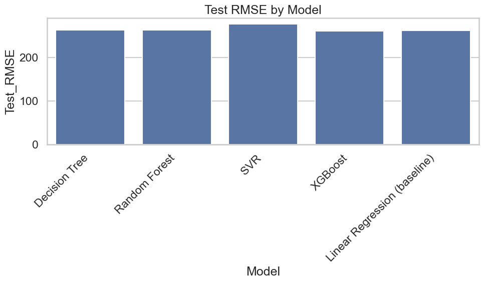
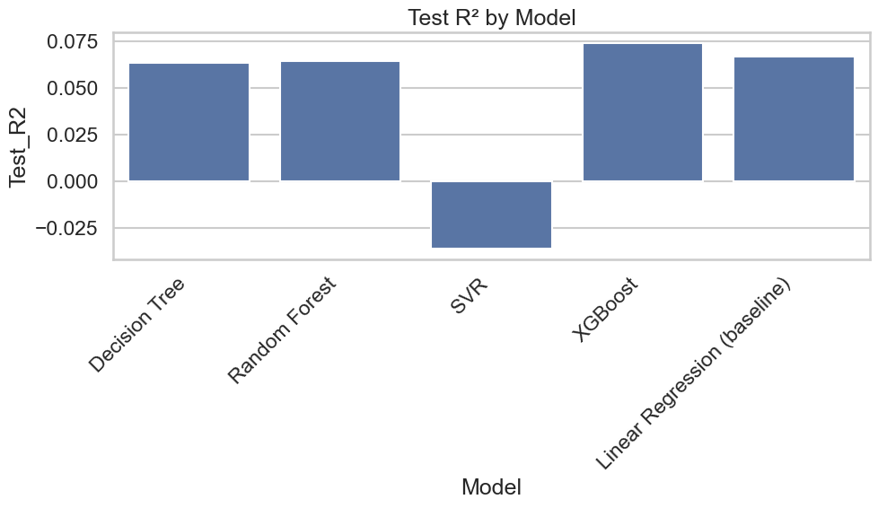
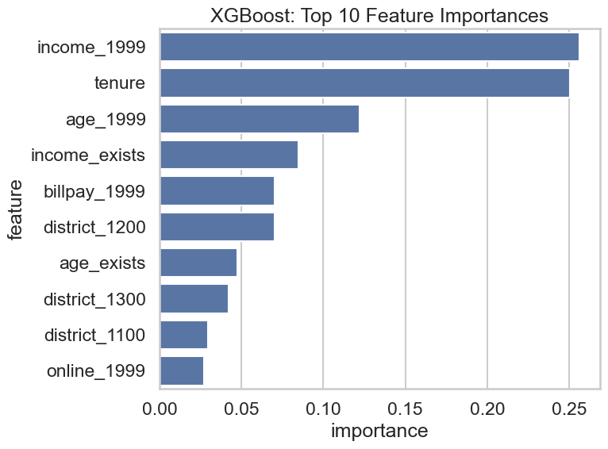
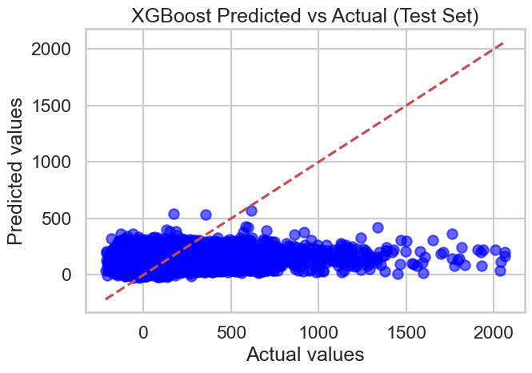

# Customer Profit Prediction using Machine Learning

## 📌 Project Overview

This project applies machine learning techniques to predict customer profitability using the Pilgrim Bank dataset. The goal is to understand which customers generate profit and how predictive models can support business decision-making.

---

## 📊 Dataset

* Source: Pilgrim Bank case study
* ~30,000 customer records
* Features include:

  * Age
  * Income
  * Tenure
  * Online usage
  * Geographic region

---

## ⚙️ Methodology

### Data Preprocessing

* Mean imputation for missing values
* Missing indicator features
* One-hot encoding for categorical variables
* Feature scaling
* Train-test split (80/20)

---

### Models Implemented

* Linear Regression (baseline)
* Decision Tree
* Random Forest
* Support Vector Machine (SVM)
* XGBoost

---

## 📈 Results

| Model             | Test RMSE | Test R² |
| ----------------- | --------- | ------- |
| XGBoost           | 260.88    | 0.074   |
| Linear Regression | 261.91    | 0.067   |
| Random Forest     | 262.24    | 0.065   |
| Decision Tree     | 262.37    | 0.064   |
| SVM               | 275.99    | -0.036  |

---

## 🔍 Key Insights

* XGBoost achieved the best performance among all models
* Random Forest showed signs of overfitting
* Overall predictive power is low, suggesting missing or unobserved factors influencing profitability

---

## 💡 Business Insights

* Customer profitability is highly skewed
* A small percentage of customers generate the majority of profits
* Machine learning can help identify high-value customers and support targeted strategies

---

## 📁 Project Structure

* `data/` → dataset
* `notebooks/` → Jupyter notebook
* `images/` → visualizations
* `reports/` → project report

---

## 🛠 Tools & Technologies

* Python
* Pandas
* Scikit-learn
* XGBoost
* Matplotlib

---

## 🚀 Future Improvements

* Include additional features (behavioral data)
* Improve model performance
* Apply explainability techniques (SHAP)

## 📊 Model Performance

---

## 🔍 Feature Importance

---

## 📈 Prediction Performance

